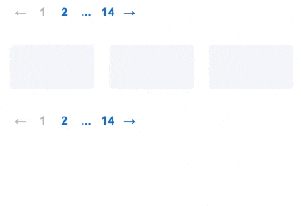

# jQuery Simple Pagination
Simple plugin for pagination with radio input



[Example](https://maximzhurkin.github.io/jquery-simple-pagination/)

## Getting Started
### Include styles & scripts
```html
<head>
  <link href="jquery.simple-pagination.min.css" rel="stylesheet">
  <script src="jquery.min.js"></script>
  <script src="jquery.simple-pagination.min.js"></script>
</head>
```
### Add container for pagination
```html
<div id="container"></div>
```
### Initialize plugin
```javascript
var example = $('#container').simplePagination({
  current: 7,
  count: 14,
  name: 'page'
});
$('#container input[name=page]').change(function() {
  console.log($(this).val());
});
$('#prev').click(function() { example.setPrevPage(); });
$('#next').click(function() { example.setNextPage(); });
$('#reset').click(function() { example.setPage(1); });
```
### Init with "mirrorContainer"
```html
<div id="container"></div>
<div class="catalog">...</div>
<div id="mirror"></div>
```
```javascript
$(document).ready(function(){
  $('#container').simplePagination({
    current: 7,
    count: 14,
    name: 'page',
    mirrorContainer: '#mirror'
  });
});
```
